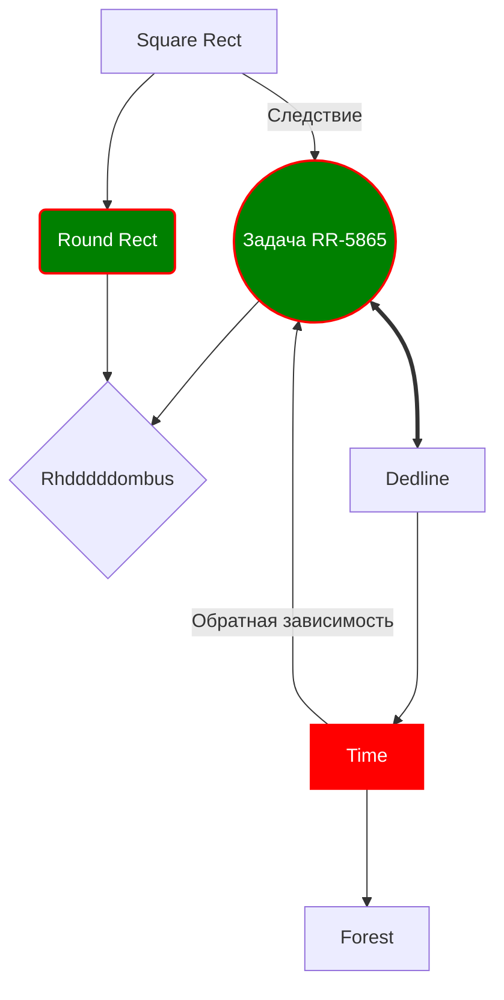

# Проект

```mermaid
graph TB

%% Определение цвета %%
classDef blue fill:green, stroke:red, stroke-width:2px,color:#fff
classDef red fill:red, stroke:red, stroke-width:2px,color:#fff

A[Square Rect] -- Следствие --> B((Задача RR-5865))
A --> C(Round Rect)
B --> D{Rhdddddombus}
C --> D 
%% Коментарий %%
B <==> X[Dedline] ---> T[Time]
T ---> F[Forest]
T----> |Обратная зависимость| B

%% цвет %%
B:::blue
C:::blue
T:::red
%% ссылки
click B "https://deskalertsdev.atlassian.net/browse/RR-5865"
```
